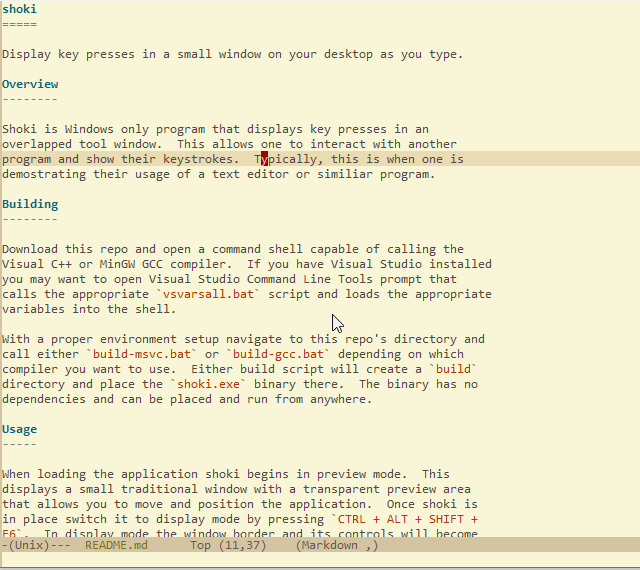

shoki
=====

Display key presses in a small window on your desktop as you type.

Overview
--------

Shoki is Windows only program that displays key presses in an
overlapped tool window.  This allows one to interact with another
program and show their keystrokes.  Typically, this is when one is
demostrating their usage of a text editor or similiar program.

Building
--------

Download this repo and open a command shell capable of calling the
Visual C++ or MinGW GCC compiler.  If you have Visual Studio installed
you may want to open Visual Studio Command Line Tools prompt that
calls the appropriate `vsvarsall.bat` script and loads the appropriate
variables into the shell.

With a proper environment setup navigate to this repo's directory and
call either `build-msvc.bat` or `build-gcc.bat` depending on which
compiler you want to use.  Either build script will create a `build`
directory and place the `shoki.exe` binary there.  The binary has no
dependencies and can be placed and run from anywhere.

Usage
-----

When loading the application shoki begins in preview mode.  This
displays a small traditional window with a transparent preview area
that allows you to move and position the application.  Once shoki is
in place switch it to display mode by pressing `CTRL + ALT + SHIFT +
F6`.  In display mode the window border and its controls will become
transparent and the black rectangle displaying key strokes will
become visible as you type and fade away during keyboard inactivity.
To switch back to preview press `CTRL + ALT + SHIFT + F6` again.

Known Issues
------------

* Shoki currently only supports keys found on U.S. keyboards.  Since I
wrote this program for me to display another program I wrote, I
haven't invested the time to support other non English characters.
This feature is definitely possible but not something I plan on doing
any time soon (or at all).

* In preview mode the black rectangle displaying key strokes in
transparent area of shoki will have a noticeable flicker as it fades
away.  This is due the interaction of mixing the transparency of GDI+
with the traditional transparency of Windows GDI.  Shoki does not
exhibit this behavior in display mode and since that is the intended
mode of operation I don't plan on spending any effort addressing this
issue.

* In some cases the modifiers are not recognized when pressing it
rapidly in succession with another key.  For example, quickly typing
`SHIFT + v` may show 'v' instead of 'V' like it is supposed to.  In
fact, my text editor would pick up the correct key combination and
display a 'V'.  I tried to address this issue with different methods
provided by the Win32 API, such as `GetAsyncKeyState` to capture when
modifier keys are pressed, but didn't have much luck.  Currently, the
work around is just to be more deliberate with your key strokes and
type a tad slower.

TODO
----

`TODO.org` displays a list of things that I would consider be useful.
Most of these are adding the appropriate Win32 widgets to the preview
mode window to allow customization.  I haven't been hard pressed for
these features since I'm the only known user of shoki and if I want
something changed I just the change the source code and recompile.

License
-------

GPL Version 3
